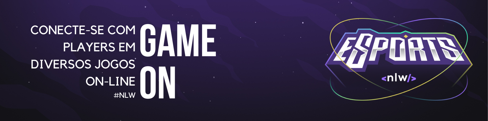
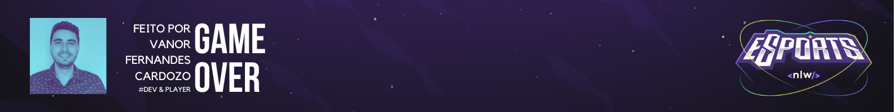

<h1 align="center">
    
</h1>

<h4 align="center"> 
	<< eSports - navegue pelos links >>
</h4>

<p align="center">
 <a href="#-sobre-o-projeto">Sobre e Funcionalidades</a> •
 <a href="#-design">Design</a> •
 <a href="#-como-executar-o-projeto">Como executar</a> • 
 <a href="#-tecnologias">Tecnologias</a> 
</p>


## 💻 Sobre o projeto

App eSports - é uma forma de conectar jogadores. Você poderá visualizar usuários disponíveis por tipo de jogo e se conectar através do nickname do Discord, também é possível se cadastrar na plataforma e aguardar uma conexão.

Projeto desenvolvido durante a **NLW - Next Level Week** oferecida pela Rocketseat.
O NLW é uma experiência online com muito conteúdo prático, desafios e hacks onde o conteúdo fica disponível durante uma semana.


## ⚙️ Funcionalidades

- [x] Players podem publicar um anúncio na plataforma WEB selecionando:
    - O game
    - Nome ou nickName
    - Experiência no jogo
    - ID do Discord
    - Dias que costuma jogar
    - Horário que costuma jogar
    - Utiliza chat de voz
    
- [x] Os usuários tem acesso ao aplicativo MOBILE, onde podem:
  - [x] navegar pelos cards de jogos e visualizar od anúncios disponíveis 
  - [x] copiar o ID do Discord e entrar em contato com outros players
  
  
## 🎨 Design

Versão Web


Versão Mobile


## 🚀 Como executar o projeto

Este projeto é divido em três partes:
1. Backend (pasta server) 
2. Frontend (pasta web)
3. Mobile (pasta mobile)

💡Tanto o Frontend quanto o Mobile precisam que o Backend esteja sendo executado para funcionar.

### Pré-requisitos

Antes de começar, você vai precisar ter instalado em sua máquina as seguintes ferramentas:
[Git](https://git-scm.com), [Node.js](https://nodejs.org/en/). 
Além disto é bom ter um editor para trabalhar com o código como [VSCode](https://code.visualstudio.com/)

#### 🎲 Rodando o Backend (servidor)

```bash

# Clone este repositório
$ git clone git@github.com:vanor-cardozo/eSports.git

# Acesse a pasta do projeto no terminal/cmd
$ cd esports

# Vá para a pasta server
$ cd server

# Instale as dependências
$ npm install

# Execute a aplicação em modo de desenvolvimento
$ npm run dev

# O servidor iniciará na porta:3333 - acesse http://localhost:3333 

```

#### 🧭 Rodando a aplicação web (Frontend)

```bash

# Acesse a pasta do projeto no seu terminal/cmd
$ cd esports

# Vá para a pasta da aplicação Front End
$ cd web

# Instale as dependências
$ npm install

# Execute a aplicação em modo de desenvolvimento
$ npm run dev

# A aplicação será aberta em uma porta indicada no terminal

```

#### 🚀 Rodando a aplicação Mobile

```bash

# Acesse a pasta do projeto no seu terminal/cmd
$ cd esports

# Vá para a pasta da aplicação Mobile
$ cd mobile

# Instale as dependências
$ npm install

# Execute a aplicação em modo de desenvolvimento
$ expo start

# Após a execução do start, será mostrado no terminal um QR Code, você pode escanear esse código com seu celular (baixe na loja do seu celular o app Expo Go).

```

## 🛠 Tecnologias

- [x] Website (React + TypeScript)
    - Radix-ui
    - Axios
    - Phospor
    - Vite
    - TailWind
    
 - [x] Server (NodeJS + TypeScript)
    - Express
    - Prisma
    - SQLite
    - Cors

 - [x] Mobile (React Native + TypeScript)
    - Expo
    - Phosphor
    - SQLite
    - Cors
---

<h1 align="center">
    
</h1>
